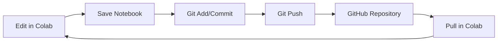

# Colab Notebook Sync & Integration

This document explains how to sync Google Colab notebooks into this repository and how to keep them in sync going forward.

## 🎯 Goal

Provide a repeatable, secure method for editing notebooks in Colab and pushing updates back to this GitHub repository.

## 📋 Prerequisites

1. A GitHub Personal Access Token (PAT) with `repo` scope
2. Git configured in your Colab environment
3. Access to the repository

## 🚀 Quick Start

### Step 1: Clone Repository in Colab

```python
# Clone the repository
!git clone https://github.com/hynestyler3699-sketch/computer-embeded-NVMe-storage-GDS-remote-GPU-linux.git
%cd computer-embeded-NVMe-storage-GDS-remote-GPU-linux

# Configure git
!git config user.email "hynestyler3699@gmail.com"
!git config user.name "hynestyler3699-sketch"
```

### Step 2: Store GitHub Token Securely

> [!CAUTION]
> **Never hardcode your GitHub token in notebooks!** Use Colab secrets or environment variables.

```python
# Option A: Use Colab Secrets (Recommended)
from google.colab import userdata
github_token = userdata.get('GITHUB_TOKEN')

# Option B: Use input (Less secure but works)
import getpass
github_token = getpass.getpass("Enter GitHub Token: ")
```

### Step 3: Save and Push Notebook

```python
import os

# Save the current notebook
from google.colab import drive
# Alternatively, download notebook manually

# Stage and commit
!git add notebooks/your_notebook.ipynb
!git commit -m "Update notebook from Colab"

# Push using token
os.environ['GITHUB_TOKEN'] = github_token
!git push https://{github_token}@github.com/hynestyler3699-sketch/computer-embeded-NVMe-storage-GDS-remote-GPU-linux.git HEAD:main
```

## 📁 Notebook Location

All Colab notebooks should be stored in the `notebooks/` directory:

```
notebooks/
├── colab-notebook.ipynb
├── gds_benchmark.ipynb
├── pytorch_training.ipynb
└── ...
```

## 🔄 Sync Workflow



## 🛠️ Helper Script

Use the provided `scripts/push_from_colab.sh` script:

```bash
# Set your token
export GITHUB_TOKEN="ghp_your_token_here"

# Push changes
./scripts/push_from_colab.sh "Update notebook" notebooks/your_notebook.ipynb
```

## 🔐 Security Best Practices

1. **Use Colab Secrets**: Store your PAT in Colab's secret manager
2. **Use Fine-Grained PATs**: Create tokens with minimal permissions
3. **Rotate Tokens Regularly**: Regenerate tokens periodically
4. **Never Commit Tokens**: Always use `.gitignore` to exclude credential files

## 📚 Related Documentation

- [GDS Setup Guide](gds-setup.md)
- [Architecture Overview](architecture.md)
- [API Reference](api.md)
