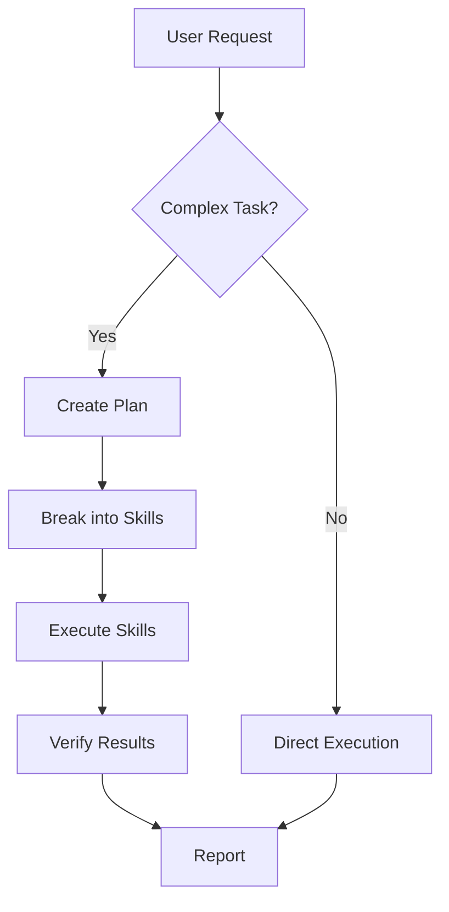

# Superpowers Integration & Quickstart

Superpowers is a workflow framework for AI coding agents, providing skills, plans, and subagent coordination. This document explains how to integrate Superpowers into this repository.

## 🎯 What is Superpowers?

Superpowers extends AI coding assistants with:

- **Skills**: Reusable instruction sets for specialized tasks
- **Plans**: Structured multi-step workflows
- **Subagents**: Delegated task execution

## 🚀 Quick Start

### 1. Add Superpowers to Your Workflow

Reference the documentation files when interacting with AI coding agents:

```
docs/
├── COLAB_SYNC.md     # Notebook integration
├── SUPERPOWERS.md    # This file
├── gds-setup.md      # Hardware setup
└── ...
```

### 2. Use with Coding Agents

When working with Claude, Cursor, or similar AI assistants:

1. Point the agent to relevant documentation
2. Request specific skills or workflows
3. Use structured task definitions

### 3. Create Custom Skills

Add skills to a `skills/` directory:

```
skills/
├── gds_benchmark/
│   ├── SKILL.md          # Main instructions
│   ├── scripts/          # Helper scripts
│   └── examples/         # Reference implementations
├── colab_deploy/
│   └── SKILL.md
└── ...
```

## 📁 Skill File Format

```yaml
---
name: GDS Benchmark
description: Run GPU-Direct Storage performance benchmarks
---

# GDS Benchmark Skill

## Prerequisites
- NVIDIA GPU with GDS support
- nvidia-fs kernel module loaded

## Steps
1. Configure cufile.json
2. Run benchmark script
3. Collect and analyze results

## Commands
\`\`\`bash
./scripts/run_gds_benchmark.sh --device /dev/nvme0n1 --size 1G
\`\`\`
```

## 🔄 Workflow Integration



## 🛠️ Available Skills

| Skill | Description | Status |
|-------|-------------|--------|
| `colab_sync` | Notebook synchronization | ✅ Ready |
| `gds_setup` | GDS environment configuration | ✅ Ready |
| `benchmark` | Performance testing | 🔄 Planned |
| `deploy` | Production deployment | 🔄 Planned |

## 💡 Best Practices

1. **Modular Skills**: Keep skills focused on single tasks
2. **Clear Prerequisites**: Document all requirements
3. **Testable Steps**: Include verification commands
4. **Examples**: Provide concrete usage examples

## 🤝 Contributing

To add a new skill:

1. Create a new directory under `skills/`
2. Add a `SKILL.md` with YAML frontmatter
3. Include any helper scripts
4. Submit a PR with examples

## 📚 Resources

- [Superpowers GitHub](https://github.com/obra/superpowers) (if applicable)
- [Colab Sync Guide](COLAB_SYNC.md)
- [GDS Setup Guide](gds-setup.md)

## 💰 Sponsorship

If Superpowers helped your project, consider supporting the maintainers:

- <https://github.com/sponsors/obra>
